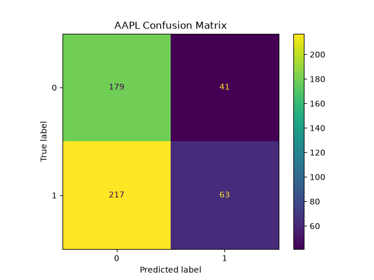
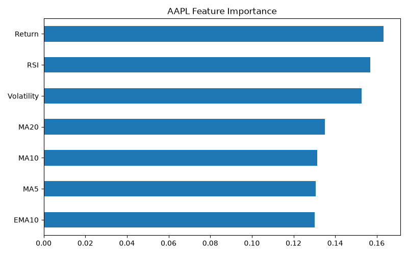

# 📈 Stock Movement Predictor


## 📌 Overview

Stock Movement Predictor is a Machine Learning project that predicts whether a stock's closing price will move **UP** or **DOWN** on the next trading day.

Instead of attempting to predict the exact stock price, the project focuses on **binary classification**, which is a more practical and realistic machine learning problem in financial markets.

Historical stock data is collected from **Yahoo Finance**, transformed into technical indicators, and used to train multiple machine learning models.

---

# 🚀 Features

- Download historical stock prices using **Yahoo Finance**
- Automated preprocessing pipeline
- Feature Engineering using technical indicators
- Multiple Machine Learning models
- Time-series train/test split
- Model evaluation
- Confusion Matrix
- ROC Curve
- Feature Importance
- Interactive Streamlit Dashboard
- Simple Backtesting Strategy

---

# 📊 Dataset

Source:
- Yahoo Finance (`yfinance`)

Stocks Used:

- Apple (AAPL)
- Amazon (AMZN)
- Google (GOOGL)
- Microsoft (MSFT)
- Tesla (TSLA)

Time Period:

2015 – 2025

---

# ⚙️ Machine Learning Pipeline

### 1. Data Collection

Historical stock prices are downloaded using the `yfinance` Python library.

### 2. Data Preprocessing

- Missing value removal
- Duplicate removal
- Date formatting
- Sorting by date

### 3. Feature Engineering

The following features are generated:

- Daily Return
- Moving Average (5)
- Moving Average (10)
- Moving Average (20)
- Exponential Moving Average (EMA10)
- Relative Strength Index (RSI)
- Volatility

Target Variable:

```
1 → Stock goes UP tomorrow
0 → Stock goes DOWN tomorrow
```

---

# 🤖 Models Used

- Logistic Regression
- Decision Tree
- Random Forest Classifier

The best-performing model is automatically saved for each stock.

---

# 📈 Evaluation Metrics

The following metrics are computed:

- Accuracy
- Precision
- Recall
- F1 Score
- Confusion Matrix
- ROC Curve
- Feature Importance

Typical accuracy ranges between **48% and 54%**, which is realistic for next-day stock direction prediction.

---

# 📊 Sample Results

## Confusion Matrix



---

## Feature Importance



---

# 🌐 Streamlit Dashboard

The project also includes an interactive Streamlit application where users can:

- Select a stock
- Predict next-day movement
- View model confidence
- Visualize recent stock prices

Run locally:

```bash
streamlit run app.py
```

---

# 📂 Project Structure

```text
Stock-Movement-Predictor/
│
├── data/
│   ├── raw/
│   └── processed/
│
├── models/
│
├── notebooks/
│
├── results/
│
├── src/
│   ├── download_data.py
│   ├── preprocess.py
│   ├── feature_engineering.py
│   ├── train.py
│   ├── evaluate.py
│   ├── backtest.py
│   └── predict.py
│
├── app.py
├── requirements.txt
├── README.md
└── .gitignore
```

---

# 🛠 Technologies Used

- Python
- Pandas
- NumPy
- Scikit-Learn
- Matplotlib
- yfinance
- TA
- Streamlit
- Joblib

---

# 📌 Future Improvements

- LSTM / GRU models
- XGBoost & LightGBM
- Hyperparameter tuning
- Live Yahoo Finance API integration
- TradingView-style dashboard
- Portfolio optimization
- Risk management metrics
- Multi-stock comparison

---

# ⚠️ Disclaimer

This project is intended **for educational purposes only**.

The predictions generated by the model should **not** be considered financial advice or used for making real investment decisions.

---

# 👨‍💻 Author

**Himanshu Gidwani**

GitHub:
https://github.com/HGidwani2005